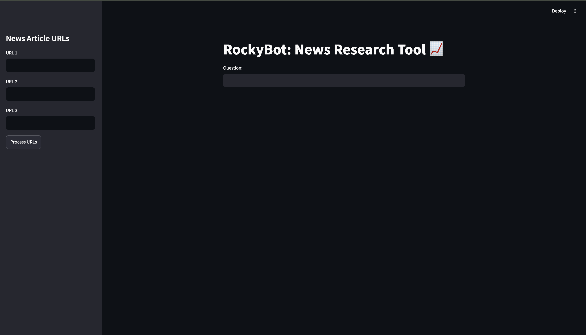
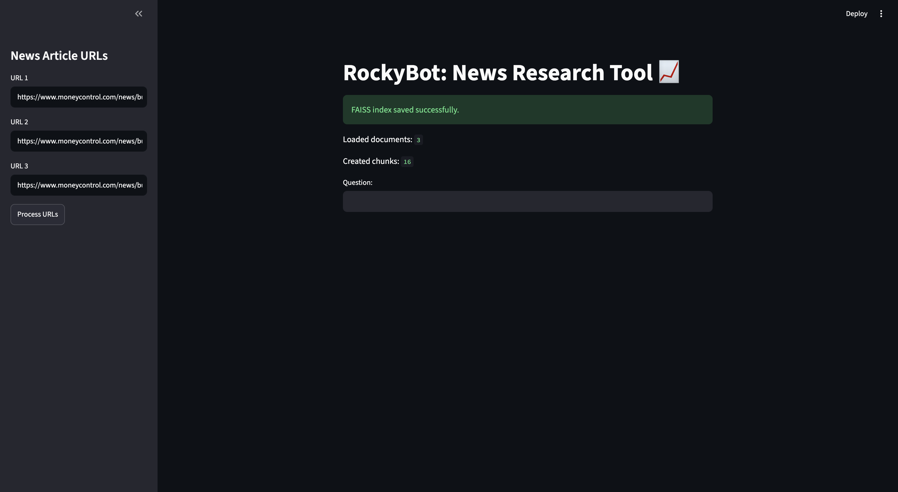
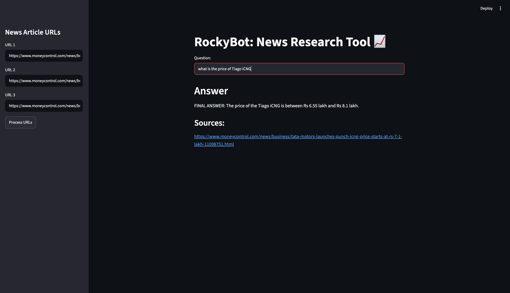

# LangChain Groq News Research RAG

A Streamlit-based Retrieval-Augmented Generation (RAG) application that allows users to load news article URLs, build a FAISS vector index, and ask source-grounded questions using Groq LLMs and HuggingFace embeddings.

## Application Screenshots

### Home Page



### URL Processing



### Question Answering



## Features

- Load up to three news article URLs
- Extract article content using LangChain document loaders
- Split text into overlapping chunks for better retrieval
- Generate embeddings using HuggingFace BGE embeddings
- Store and retrieve vectors using FAISS
- Answer user questions using Groq LLMs
- Display source URLs for generated answers

## Tech Stack

- Python
- Streamlit
- LangChain
- Groq
- HuggingFace Embeddings
- FAISS
- Sentence Transformers
- Unstructured

## Project Architecture

```text
News URLs
   ↓
UnstructuredURLLoader
   ↓
RecursiveCharacterTextSplitter
   ↓
HuggingFace Embeddings
   ↓
FAISS Vector Store
   ↓
Retriever
   ↓
Groq LLM
   ↓
Answer with Sources